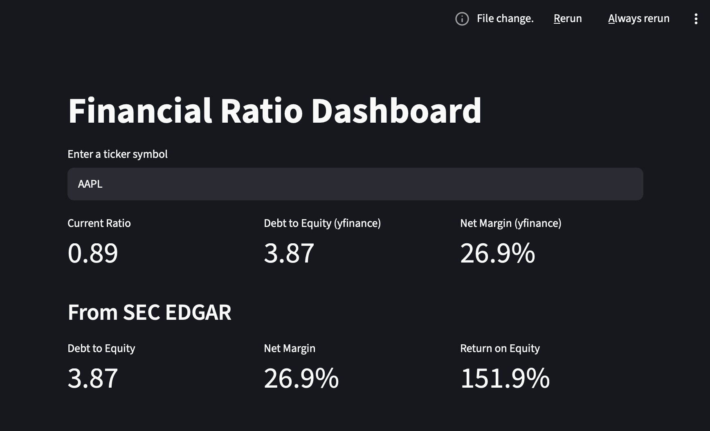

# Financial Ratio Dashboard

An interactive dashboard that pulls company financial data from two independent sources — **Yahoo Finance** and **SEC EDGAR** — and calculates key financial ratios side by side, so you can cross-check the numbers instead of trusting a single source blindly.

 

## What it does

Enter any stock ticker (e.g. `AAPL`, `MSFT`, `TSLA`) and the dashboard returns:

**From Yahoo Finance (yfinance)**
- Current Ratio
- Debt-to-Equity
- Net Margin

**From SEC EDGAR (company filings)**
- Debt-to-Equity
- Net Margin
- Return on Equity (ROE)

Having both sources side by side lets you spot-check that the numbers are consistent, rather than relying on one API's interpretation of a company's financials.

## How it works

- **`ratios.py`** — the data layer. Fetches raw financial statements from yfinance and structured XBRL facts from SEC EDGAR (via the `edgartools` library), then calculates each ratio with error handling for missing or inconsistent data.
- **`dashboard.py`** — the presentation layer. A [Streamlit](https://streamlit.io) app that takes a ticker input and displays the results as clean metric cards.

Keeping these separate means the ratio-calculation logic can be tested, reused, or extended independently of the UI.

## Tech stack

- Python
- [yfinance](https://pypi.org/project/yfinance/) — market and financial statement data
- [edgartools](https://pypi.org/project/edgartools/) — SEC EDGAR filings and XBRL facts
- [Streamlit](https://streamlit.io) — web dashboard framework
- pandas

## Running it locally

1. Clone the repo:
   ```
   git clone https://github.com/your-username/your-repo-name.git
   cd your-repo-name
   ```

2. Install dependencies:
   ```
   pip install -r requirements.txt
   ```

3. Set your SEC EDGAR identity (required by SEC for API access — any name/email works):
   Create a `.env` file in the project root:
   ```
   SEC_IDENTITY=Your Name your.email@example.com
   ```

4. Run the app:
   ```
   streamlit run dashboard.py
   ```

## Notes

- yfinance is an unofficial data source and can occasionally return incomplete data; ratios that can't be calculated are shown as "N/A" rather than causing an error.
- SEC EDGAR concept tags vary slightly between companies, so ratio availability may differ by ticker.

## Possible future additions

- Multi-year ratio trends instead of most-recent-year only
- More ratios (ROA, quick ratio, interest coverage, etc.)
- Ticker comparison view
